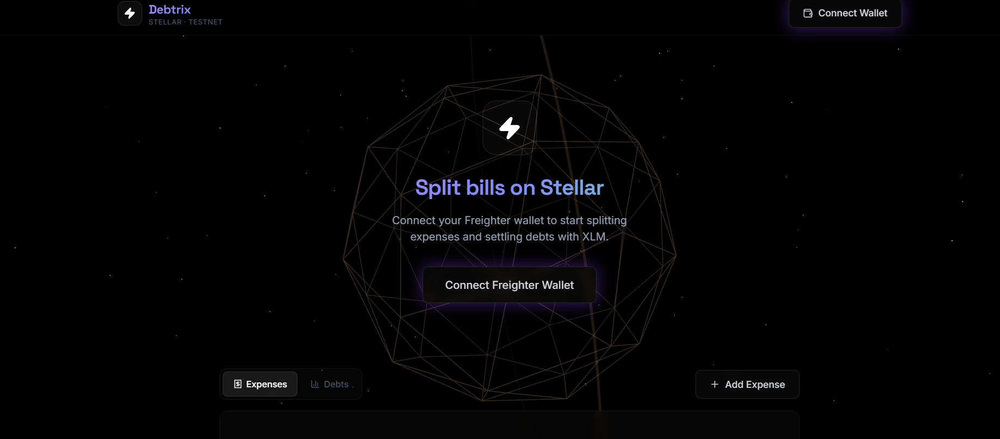

<](https://stellar.org)
[](https://react.dev)
[](https://vitejs.dev)
[](https://threejs.org)
[](https://opensource.org/licenses/MIT)

</div>

---

## 📌 Project Description

**Debtrix** is a blockchain-powered expense-splitting application that removes the trust issues, confusion, and friction of group payments. Instead of relying on centralized services, Debtrix leverages the **Stellar blockchain** for transparent, instant, and near-free settlements using **XLM**.

### Why Debtrix?

| Problem | Debtrix Solution |
|---------|-----------------|
| "Who paid for what?" confusion | All expenses tracked with participant addresses |
| Trust issues in group payments | Settlements happen on-chain — fully transparent |
| Slow bank transfers for settling | Stellar transactions settle in ~5 seconds |
| High fees on payment apps | Stellar fees are < 0.00001 XLM (~$0.000001) |

### Target Users
- 🎓 **Students** — roommates, trips, group expenses
- 💼 **Freelancers & teams** — project cost splitting
- 🍕 **Friends** — splitting restaurant bills, groceries
- 👥 **Any group** needing transparent payment tracking

---

## 🚀 Features (Level 1 — White Belt)

### 💳 Wallet Integration
- **Connect/Disconnect** Freighter wallet with one click
- Session persistence across page reloads via `localStorage`
- Automatic reconnection on revisiting the app
- Network badge showing **TESTNET** status

### 💰 Balance Display
- Real-time **XLM balance** fetched from Stellar Horizon Testnet API
- Auto-refreshing balance polling (every 15 seconds)
- Graceful handling of unfunded accounts

### 🧾 Expense Management
- Add shared expenses with description, amount, and participants
- Support for **Equal Split** and **Manual Split** modes
- Participants identified by Stellar public keys (`G...` addresses)
- Full expense persistence in `localStorage` (survives page reloads)

### ⚖️ Debt Engine
- Intelligent **greedy two-pointer algorithm** that simplifies debts
- Minimizes the total number of transactions needed to settle all debts
- Real-time "You Owe" / "You're Owed" dashboard

### 💸 XLM Settlement
- One-click debt settlement via XLM payment transactions
- Transaction signing through **Freighter wallet**
- Real-time feedback: pending → success/failure states
- Transaction hash display with direct link to [Stellar Expert](https://stellar.expert) block explorer

### 🎨 Premium UI
- **Three.js WebGL** animated background with a light copper wireframe globe
- Ultra-minimal dark glassmorphism design
- Smooth micro-animations and responsive layout
- Google Fonts typography (Inter + Space Grotesk)

---

## 🏗️ System Design & Architecture

```
┌──────────────────────────────────────────────────────────────────────┐
│                        DEBTRIX ARCHITECTURE                         │
│                     Level 1 — White Belt MVP                        │
└──────────────────────────────────────────────────────────────────────┘

┌─────────────────────────────┐
│       PRESENTATION LAYER    │
│                             │
│  ┌───────────────────────┐  │     ┌─────────────────────────────┐
│  │   AnimatedBackground  │  │     │     External Services       │
│  │   (Three.js Canvas)   │  │     │                             │
│  └───────────────────────┘  │     │  ┌───────────────────────┐  │
│  ┌───────────────────────┐  │     │  │  Stellar Horizon API  │  │
│  │   Header + WalletBar  │  │     │  │  (Testnet)            │  │
│  └───────────────────────┘  │     │  │  - Account info       │  │
│  ┌───────────────────────┐  │     │  │  - Submit tx          │  │
│  │   App (Main Shell)    │  │     │  │  - Balance fetch      │  │
│  │  ┌─────┐ ┌──────────┐│  │     │  └───────────────────────┘  │
│  │  │Stats│ │Tab System ││  │     │  ┌───────────────────────┐  │
│  │  └─────┘ └──────────┘│  │     │  │  Freighter Extension  │  │
│  │  ┌──────────────────┐│  │     │  │  - Key management     │  │
│  │  │  ExpenseList     ││  │◄────►│  │  - Tx signing         │  │
│  │  │  DebtSummary     ││  │     │  │  - Access control      │  │
│  │  │  ExpenseForm     ││  │     │  └───────────────────────┘  │
│  │  │  SettleModal     ││  │     └─────────────────────────────┘
│  │  │  TxFeedback      ││  │
│  │  └──────────────────┘│  │
│  └───────────────────────┘  │
└─────────────┬───────────────┘
              │
              ▼
┌─────────────────────────────┐
│      BUSINESS LOGIC LAYER   │
│         (React Hooks)       │
│                             │
│  ┌────────────────────────┐ │
│  │  useWallet             │ │  → Freighter API (connect/disconnect/getAddress)
│  ├────────────────────────┤ │
│  │  useBalance            │ │  → Horizon API (GET /accounts/{id})
│  ├────────────────────────┤ │
│  │  useExpenses           │ │  → localStorage (CRUD + debt graph algorithm)
│  ├────────────────────────┤ │
│  │  useTransaction        │ │  → Stellar SDK (build tx) + Freighter (sign) + Horizon (submit)
│  └────────────────────────┘ │
└─────────────┬───────────────┘
              │
              ▼
┌─────────────────────────────┐
│      DATA / STORAGE LAYER   │
│                             │
│  ┌────────────────────────┐ │
│  │  localStorage          │ │  → Expenses, wallet pubkey (persistent across reloads)
│  ├────────────────────────┤ │
│  │  Stellar Testnet       │ │  → XLM balances, transaction history (on-chain)
│  └────────────────────────┘ │
└─────────────────────────────┘
```

### Data Flow

```
User Action          Hook              External Service         Result
───────────          ────              ────────────────         ──────
Connect Wallet  →  useWallet      →  Freighter API         →  Public key stored
View Balance    →  useBalance     →  Horizon /accounts     →  XLM balance displayed
Add Expense     →  useExpenses    →  localStorage          →  Expense saved + debts recalculated
Settle Debt     →  useTransaction →  SDK build → Freighter →  Signed XDR → Horizon submit → Hash
                                      sign                     displayed with explorer link
```

### Debt Simplification Algorithm

The debt engine uses a **greedy two-pointer approach** to minimize payment transactions:

```
Input:  Alice owes Bob 10 XLM, Bob owes Carol 6 XLM, Alice owes Carol 4 XLM
        → Net balances: Alice: -14, Bob: +4, Carol: +10

Step 1: Sort by balance (debtors first, creditors last)
Step 2: Match largest debtor with largest creditor
Step 3: Transfer min(|debt|, |credit|), adjust balances
Step 4: Repeat until all balances are zero

Output: Alice → Carol: 10 XLM, Alice → Bob: 4 XLM  (2 transactions instead of 3)
```

---

## 📸 Screenshots

### Landing Page — Wallet Disconnected
The home screen featuring the animated 3D copper wireframe globe, starfield background, and the wallet connection prompt.



### Dashboard — Wallet Connected & Balance Displayed
After connecting Freighter, the dashboard shows the live XLM balance (10,000 XLM on Testnet), expense statistics, and the tabbed interface for managing expenses and debts.


---

## 🛠️ Tech Stack

| Layer | Technology | Purpose |
|-------|-----------|---------|
| **Frontend** | React 19 + Vite 8 | Component-based UI with HMR |
| **Styling** | Vanilla CSS | Custom glassmorphism design system |
| **3D Graphics** | Three.js + React Three Fiber + Drei | Animated WebGL background |
| **Blockchain SDK** | `@stellar/stellar-sdk` | Transaction building & Horizon API |
| **Wallet** | `@stellar/freighter-api` v6 | Wallet connection & transaction signing |
| **Icons** | Lucide React | Lightweight SVG icon set |
| **Fonts** | Google Fonts (Inter, Space Grotesk) | Premium typography |

---

## ⚙️ Setup Instructions

### Prerequisites

- **Node.js** v18 or higher
- **npm** v9 or higher
- **Freighter Wallet** browser extension ([Install here](https://www.freighter.app/))
- Freighter set to **Stellar Testnet**

### Installation

```bash
# 1. Clone the repository
git clone https://github.com/subhadip890/Debtrix.git
cd Debtrix

# 2. Install dependencies
npm install

# 3. Start the development server
npm run dev
```

The app will be available at **http://localhost:5173/**

### Fund Your Testnet Wallet

1. Open Freighter and switch to **Testnet**
2. Copy your public key (`G...` address)
3. Visit the [Stellar Friendbot](https://friendbot.stellar.org?addr=YOUR_PUBLIC_KEY) to get 10,000 test XLM

### Production Build

```bash
npm run build
npm run preview
```

---

## 📂 Project Structure

```
Debtrix/
├── index.html                    # Entry HTML with SEO meta tags
├── vite.config.js                # Vite config with buffer polyfill
├── package.json                  # Dependencies and scripts
├── mind.md                       # Project roadmap & decisions tracker
│
├── src/
│   ├── main.jsx                  # React entry point
│   ├── App.jsx                   # Main app shell (stats, tabs, modals)
│   ├── index.css                 # Global design system (tokens, components)
│   │
│   ├── hooks/
│   │   ├── useWallet.js          # Freighter connect/disconnect/persist
│   │   ├── useBalance.js         # XLM balance polling from Horizon
│   │   ├── useExpenses.js        # Expense CRUD + debt simplification
│   │   └── useTransaction.js     # Build, sign, submit XLM payments
│   │
│   └── components/
│       ├── AnimatedBackground.jsx  # Three.js WebGL canvas (globe + stars)
│       ├── Header.jsx              # Top navigation bar with logo
│       ├── WalletBar.jsx           # Wallet connection status & controls
│       ├── ExpenseForm.jsx         # Modal form for adding expenses
│       ├── ExpenseList.jsx         # Scrollable list of all expenses
│       ├── DebtSummary.jsx         # Simplified debt cards with settle button
│       ├── SettleModal.jsx         # Transaction confirmation & status modal
│       └── TransactionFeedback.jsx # Toast notifications for tx results
│
└── screenshots/
    ├── landing.png               # Wallet disconnected state
    └── balance.png               # Wallet connected + balance displayed
```

---

## 🥋 Roadmap

| Level | Belt | Status | Focus |
|-------|------|--------|-------|
| **1** | ⚪ White | ✅ Complete | Wallet, balance, transactions, UI |
| **2** | 🟡 Yellow | 🔜 Next | Soroban smart contracts, multi-wallet |
| **3** | 🟠 Orange | Planned | Dashboard, history, tests |
| **4** | 🟢 Green | Planned | Groups, auto-settlement, CI/CD |

---

## 📝 Commit History (Level 1)

| # | Commit Message |
|---|---------------|
| 1 | `init: setup Vite + React + Tailwind project` |
| 2 | `feat: implement wallet connect and disconnect` |
| 3 | `feat: fetch and display XLM balance` |
| 4 | `feat: add expense input and debt calculation logic` |
| 5 | `feat: implement XLM transaction with feedback UI` |

---

## 🤝 Contributing

1. Fork the repository
2. Create a feature branch (`git checkout -b feat/your-feature`)
3. Commit your changes (`git commit -m 'feat: add your feature'`)
4. Push to the branch (`git push origin feat/your-feature`)
5. Open a Pull Request

---

## 📄 License

This project is licensed under the MIT License. See [LICENSE](LICENSE) for details.

---

<div align="center">

**Built with ⚡ on Stellar Testnet**

[Stellar](https://stellar.org) · [Freighter](https://freighter.app) · [Horizon API](https://horizon-testnet.stellar.org)

</div>
]]>
