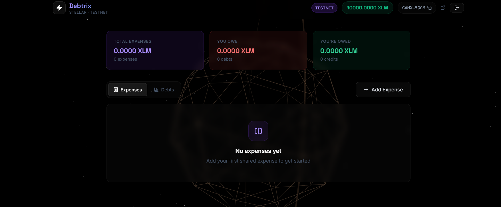
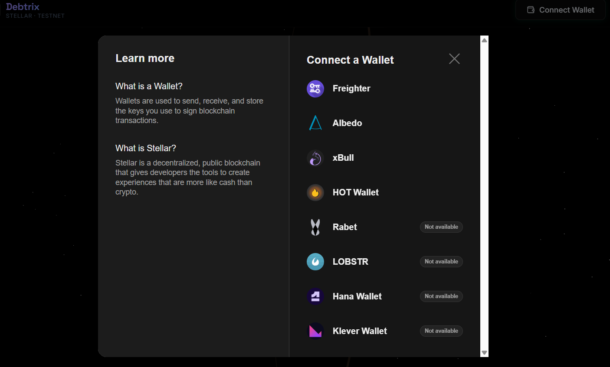
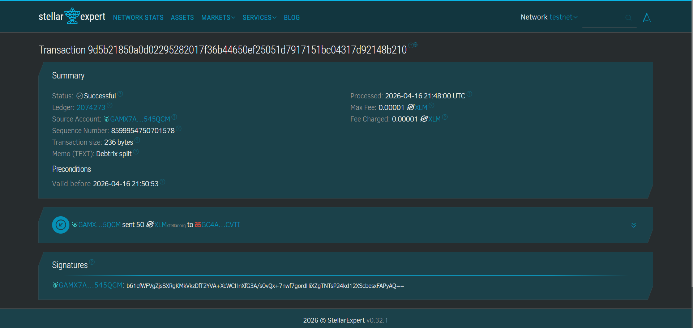

# ⚡ Debtrix — Expense Split & Auto-Pay on Stellar

> A Decentralized Payment Tracker and Expense-Splitting dApp built on the **Stellar Testnet**.

[](https://stellar.org)
[](https://react.dev)
[](https://vitejs.dev)
[](LICENSE)

---

## 📌 Project Description

**Debtrix** is a blockchain-powered split-payment application built for the Stellar ecosystem. It removes the friction, confusion, and trust issues of group payments by letting users calculate exact individual shares and settle debts directly using **XLM** on the Stellar Testnet — all without any central intermediary.

Every single payment is written permanently into a globally accessible Soroban Smart Contract, giving users a fully transparent, fraud-proof transaction history.

### 🚀 How Debtrix Works

1. **Connect a Wallet:** Support for multiple Stellar wallets like Freighter, Albedo, and xBull.
2. **Divided By N:** Enter a total XLM amount and the number of people splitting it. The app calculates the exact share per person dynamically.
3. **Fill Receivers:** Enter the Stellar recipient addresses for the people you are paying.
4. **Settle Payment:** The app executes sequential `payment` operations directly on the Stellar testnet, then invokes a Soroban Host Function to write a permanent `PaymentLog` struct to the Smart Contract.
5. **Live Feed:** The "Live Smart Contract Feed" runs continuous `simulateTransaction` queries against the deployed Smart Contract, pushing real-time global payments directly to the UI.

### 🏗️ System Design & Architecture Flow

```text
┌──────────────────────────────────────────────────────────────┐
│                     PRESENTATION LAYER                       │
│  AnimatedBackground.jsx  ── Three.js WebGL Canvas            │
│  App.jsx                 ── Core Application Shell           │
│    ├── DirectPayment.jsx ── Split payment UI                 │
│    ├── RecentActivity.jsx── Live Smart Contract Feed         │
│    └── TransactionFeedback.jsx ── Status Toasts              │
└─────────────────────────┬────────────────────────────────────┘
                          │ Props / Callbacks
                          ▼
┌──────────────────────────────────────────────────────────────┐
│                   BUSINESS LOGIC LAYER                       │
│  useWallet.js       ── Wallet session & persistence          │
│  useTransaction.js  ── Build tx · Sign via Kit · Submit      │
│  useContract.js     ── invokeHostFunction & SDK queries      │
└───────┬─────────────────────────────┬────────────────────────┘
        │                             │
        ▼                             ▼
┌────────────────────┐   ┌────────────────────────────────────┐
│   STELLAR NETWORK  │   │       SMART CONTRACT (SOROBAN)     │
│                    │   │                                    │
│  Horizon Testnet   │   │  DebtrixContract                   │
│  ├── GET /accounts │   │  ├── record_payment() (write)      │
│  └── POST /txs     │   │  └── get_payments() (read)         │
└────────────────────┘   └────────────────────────────────────┘
```

#### Request Flow — Split Payment & Record On-Chain

```text
User clicks "Settle"
        │
        ▼
useTransaction.sendXLM()
        ├─ 1. Build TransactionBuilder with payment ops for each receiver
        ├─ 2. Sign XDR via Multi-Wallet Provider Extension
        ├─ 3. Submit signed transaction to Horizon Testnet
        │
        ▼ (on success)
useContract.recordPaymentOnChain()
        ├─ 1. Format PaymentLog ScVal Map
        ├─ 2. build invokeHostFunction operation
        ├─ 3. simulateTransaction → sign → sendTransaction
        │
        ▼ (on success)
RecentActivity Feed auto-refreshes by polling get_payments()
```

| Feature | Implementation Detail |
|---|---|
| **Frontend Framework** | React 19 + Vite 8 |
| **Blockchain SDK** | `@stellar/stellar-sdk` |
| **Wallet Provider** | `@creit.tech/stellar-wallets-kit` |
| **Smart Contract Logic** | Rust / Soroban |
| **Contract Queries** | `StellarSdk.SorobanRpc.Server.simulateTransaction` for gasless reads |
| **UI Design** | Custom Glassmorphism + Responsive Layout + Three.js WebGL |

---

## ⚪ Level 1 - White Belt Progression

The foundation of the application successfully implements all standard Stellar SDK capabilities required for the White Belt.

### ✅ Implemented Features

| Requirement | Implementation |
|---|---|
| Freighter wallet setup | Integrated via `@stellar/freighter-api` v6 |
| Stellar Testnet | Hardcoded to Testnet; TESTNET badge shown in UI |
| Wallet connect | One-click connect with popup via `requestAccess()` |
| Fetch XLM balance | Polled every 15s from Stellar Horizon Testnet API |
| Send XLM transaction | Full settle flow: build → sign → submit on Testnet |
| Transaction feedback | Success/failure state + transaction hash shown in UI |
| Error handling | Covers no wallet, declined tx, insufficient balance |

### 📸 White Belt Artifacts

**Wallet Connected & Live Balance Fetched:**


---

## 🟡 Level 2 - Yellow Belt Submission

This project builds seamlessly upon the White Belt foundation to satisfy all requirements for the **Yellow Belt (Payment Tracker)**.

### ✅ Submission Checklist Met

- **3 error types handled:** 
  1. Wallet not found/connected
  2. Transaction rejected by user in Freighter
  3. Insufficient balance (checks for minimum XLM balance + reserve limit)
- **Contract deployed on testnet:** Rust Soroban contract deployed (ID listed below).
- **Contract called from the frontend:** Contract invoked using `StellarSdk.Operation.invokeHostFunction`.
- **Reading and writing data:** The frontend writes new payments using the `record_payment` host function and queries the global history feed using `get_payments`.
- **Event listening / State synchronization:** Upon a successful transaction, the "Live Smart Contract Feed" automatically polls the chain, keeping the UI perfectly synchronized with the blockchain state.
- **Transaction status visible:** Pending, Success, and Fail states are fully designed and displayed to the user with exact error codes.
- **Minimum 2+ meaningful commits:** Fully version-controlled and pushed.

### 📸 Required Submission Evidence

#### 1. Multi-Wallet Options Available
The application uses `@creit.tech/stellar-wallets-kit` to seamlessly support multiple network wallets.


#### 2. Transaction Hash / Contract Call Verification
A successful XLM split payment recording its transaction onto the Soroban smart contract.


#### 3. Deployed Contract Address (Testnet)
```text
CA5OIXRV6XOLVWSM2OOQEJZRK3XNN7T7NLTQ32IZH6ZWXIWZO5JKT6R3
```

#### 4. Live Demo Link (Optional)
*(Live Demo URL can be placed here if deployed via Vercel/Netlify)*

---

## ⚙️ Setup Instructions

### Prerequisites
- **Node.js** v18+
- [Freighter Wallet](https://www.freighter.app/) extension installed and switched to **Testnet**

### Local Development

1. **Clone the repository**
```bash
git clone https://github.com/subhadip890/Debtrix.git
cd Debtrix
```

2. **Install dependencies**
```bash
npm install
```

3. **Start the development server**
```bash
npm run dev
```

Open **http://localhost:5173/** in your browser.

### Smart Contract Deployment (Rust / Soroban)
If you wish to compile and deploy your own instance of the contract:

```bash
# From the root directory, compile
cd contracts/expense_splitter
stellar contract build

# Assume you have a testnet identity setup called 'alice'
stellar contract deploy \
  --wasm target/wasm32-unknown-unknown/release/debtrix_contract.wasm \
  --source alice --network testnet
```
*After deploying, copy the resulting `C...` contract identifier and replace the `CONTRACT_ID` inside `src/hooks/useContract.js`.*

---

## 🟠 Level 3 - Orange Belt Submission

This level focuses on **quality, testing, and documentation** for a complete end-to-end mini-dApp.

### ✅ Submission Checklist Met

- **Mini-dApp fully functional:** Complete split-payment flow with contract read/write, live feed, and error handling.
- **Minimum 3 tests passing:** **21 unit tests** across 3 test suites, all passing. Run with `npm test`.
- **Loading states and progress indicators:** Multi-step progress bar during settlements, skeleton loaders in the contract feed.
- **Basic caching implemented:** TTL-based in-memory cache for XLM balance (15s) and contract reads (10s), avoiding redundant network calls.
- **README complete:** Full documentation including architecture, belt progressions, and setup guide.
- **Demo video recorded:** See link below.
- **Minimum 3+ meaningful commits:** 5 well-scoped commits for this level.

### 📸 Required Submission Evidence

#### Test Output — 21 Tests Passing

Run `npm test` to reproduce:

```
 ✓ src/__tests__/cache.test.js       (8 tests)
 ✓ src/__tests__/splitCalc.test.js   (6 tests)
 ✓ src/__tests__/validation.test.js  (7 tests)

 Test Files  3 passed (3)
      Tests  21 passed (21)
   Duration  ~565ms
```

> **Screenshot of test output:** *(Add `screenshots/test_output.png` here after running `npm test` and taking a screenshot)*

#### Live Demo Link

> *(Deploy to Vercel or Netlify and paste the live URL here)*

#### Demo Video (1 minute)

> *(Record a 1-minute Loom/YouTube video showing the full payment flow and paste the link here)*

---

## 📄 License
MIT © [subhadip890](https://github.com/subhadip890)
